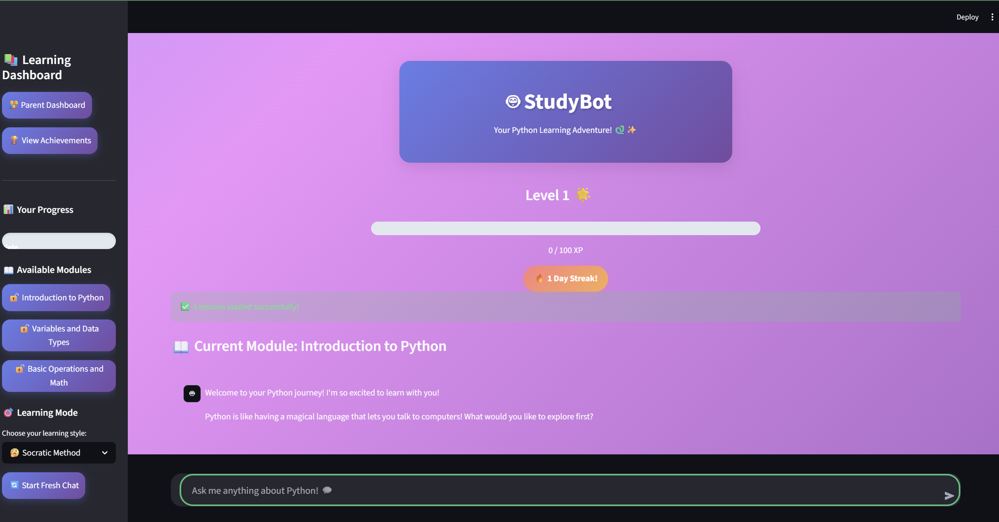

# 🤖 StudyBot - AI-Powered Python Learning Platform

**🏆 3rd Place Winner - Hackathon 2024**

**[View Hackathon Presentation](https://gamma.app/docs/Introducing-Codey-Your-Childs-Python-Learning-Companion-68nyx5iwbv63i8f?mode=doc)**

> **An intelligent, mobile-first educational platform that combines OpenAI's GPT, GitHub content parsing, and Streamlit's web framework to create personalized Python tutoring experiences.**

## üåü **Key Features**

### üéì **AI-Powered Learning**
- **Socratic Method Tutoring**: AI guides students to discover answers through questioning
- **Personalized Quiz Generation**: Dynamic assessments based on learning progress
- **Intelligent Code Evaluation**: Real-time Python code execution and feedback
- **Context-Aware Conversations**: AI remembers student progress and difficulties

### üì± **Mobile-First Design**
- **Responsive Interface**: Works seamlessly on phones, tablets, and desktops
- **Touch-Friendly UI**: 44px minimum button sizes following Apple guidelines
- **Auto-Collapsing Sidebar**: Optimized navigation for small screens
- **iOS Keyboard Fix**: 16px inputs prevent auto-zoom on mobile devices

### üíæ **Session Persistence**
- **Cross-Session Memory**: Conversations persist across browser sessions
- **Module-Specific History**: Each learning module maintains separate chat threads
- **Real-Time Saving**: Every interaction automatically saved to database
- **Smart Resume**: Students continue exactly where they left off

### üìö **Dynamic Content Management**
- **GitHub Integration**: Live content parsing from educational repositories
- **Fallback System**: Robust local content when external APIs fail
- **Progress Tracking**: Comprehensive analytics on student performance
- **Adaptive Learning**: Difficulty adjustment based on student struggles

---

## üì∏ **Screenshots**

### 🏠 **Landing Page**

*Clean, intuitive interface with easy navigation to learning modules*

### 💬 **Interactive Chat Interface**

*AI-powered conversations with real-time code execution and feedback*

### üîí **Parental Controls**

*Secure PIN-based parental controls with time limits and content filtering*

### ⭐ **Feature Overview**

*Comprehensive learning tools and progress tracking*

### üì± **Mobile-Responsive Design**

*Optimized for parents *

### 🛠️ **Code Sandbox**

*Interactive Python code editor with real-time execution and output*

## üöÄ **Quick Start**

### **Prerequisites**
- Python 3.8 or higher
- OpenAI API key (optional - app works with fallbacks)
- Git (for content updates)

### **Installation**

```bash
# Clone the repository
git clone https://github.com/pspandana/PythonStudyBot.git
cd StudyBot/PythonStudyBot

# Install dependencies
pip install -r requirements.txt

# Set up environment variables (optional)
echo "OPENAI_API_KEY=your_api_key_here" > .env

# Run the application
streamlit run app.py
```

### **First Run**
1. **Local Access**: Open `http://localhost:8501`
2. **Mobile Testing**: Use network URL for phone testing
3. **Start Learning**: Click on "Session 0 - Introduction to Python"
4. **Begin Conversation**: Ask "What is Python?" to start your learning journey

---

## 🗂️ **Architecture Overview**

```
StudyBot/
├── 📱 app.py                 # Main Streamlit application
├── 📊 database/
│   ├── db_handler.py         # SQLite database operations
│   └── init_db.sql          # Database schema
├── 🤖 agents/
│   ├── socratic_tutor.py    # AI tutoring logic
│   ├── quiz_generator.py    # Dynamic quiz creation
│   └── code_evaluator.py    # Python code execution
├── 📚 content/
│   ├── github_parser.py     # Live content parsing
│   └── prompts.py           # AI prompt management
├── 🔧 utils/
│   └── openai_client.py     # OpenAI API integration
└── 📋 requirements.txt      # Dependencies
```

---

## 💻 **Core Code Examples**

### **1. AI Socratic Tutoring Implementation**

```python
# agents/socratic_tutor.py
class SocraticTutor:
    def respond(self, user_input: str, module: Dict[str, Any], 
                chat_history: List[Dict[str, str]]) -> str:
        """
        Generate Socratic responses that guide learning through questions
        """
        # Check for direct answer requests
        if self.wants_direct_answer(user_input):
            return self.provide_direct_answer(user_input, module, chat_history)
        
        # Detect student frustration
        if self.detect_frustration(user_input, chat_history):
            return self.handle_stuck_student(user_input, module, chat_history)
        
        # Generate guiding questions
        return self.generate_socratic_response(user_input, module, chat_history)
    
    def generate_socratic_response(self, user_input: str, module: Dict[str, Any], 
                                 chat_history: List[Dict[str, str]]) -> str:
        """Use OpenAI to generate educational guiding questions"""
        if not self.client.client:
            return self.generate_fallback_response(user_input, module)
        
        system_prompt = self.prompts.get_socratic_system_prompt(module)
        
        # Build conversation context
        messages = [{"role": "system", "content": system_prompt}]
        recent_history = chat_history[-6:] if len(chat_history) > 6 else chat_history
        messages.extend(recent_history)
        messages.append({"role": "user", "content": user_input})
        
        response = self.client.generate_chat_response(messages)
        
        # Fallback if AI fails
        if not response or response.startswith("‚ùå"):
            return self.generate_fallback_response(user_input, module)
        
        return response
```

### **2. Session Persistence System**

```python
# database/db_handler.py
class DatabaseHandler:
    def save_chat_message(self, user_id: str, module_id: int, role: str, 
                         content: str, interaction_type: str = 'chat'):
        """Save individual chat messages for session persistence"""
        with sqlite3.connect(self.db_path) as conn:
            cursor = conn.cursor()
            cursor.execute("""
                INSERT INTO learning_interactions 
                (user_id, module_id, question, user_response, bot_response, 
                 interaction_type, understanding_level)
                VALUES (?, ?, ?, ?, ?, ?, ?)
            """, (
                user_id, module_id, 
                content if role == 'user' else '',
                content if role == 'user' else '',
                content if role == 'assistant' else '',
                f"{interaction_type}_{role}",
                3  # default understanding level
            ))
            conn.commit()
    
    def load_chat_history(self, user_id: str, module_id: int, 
                         limit: int = 50) -> List[Dict[str, str]]:
        """Load chat history for session restoration"""
        with sqlite3.connect(self.db_path) as conn:
            cursor = conn.cursor()
            cursor.execute("""
                SELECT question, bot_response, interaction_type, created_at
                FROM learning_interactions 
                WHERE user_id = ? AND module_id = ? 
                AND interaction_type LIKE 'chat_%'
                ORDER BY created_at ASC
                LIMIT ?
            """, (user_id, module_id, limit))
            
            results = cursor.fetchall()
            chat_history = []
            
            for question, bot_response, interaction_type, created_at in results:
                if interaction_type.endswith('_user') and question:
                    chat_history.append({
                        'role': 'user',
                        'content': question,
                        'timestamp': created_at
                    })
                elif interaction_type.endswith('_assistant') and bot_response:
                    chat_history.append({
                        'role': 'assistant', 
                        'content': bot_response,
                        'timestamp': created_at
                    })
            
            return chat_history
```

### **3. Mobile-Responsive Streamlit Setup**

```python
# app.py - Mobile Configuration
st.set_page_config(
    page_title="StudyBot - Learn Python with AI",
    page_icon="🤖",
    layout="wide",
    initial_sidebar_state="auto",  # Better for mobile
    menu_items={
        'Get Help': 'https://www.python.org/',
        'Report a bug': None,
        'About': "StudyBot - Your Python Learning Buddy! üêç‚ú®"
    }
)

# Mobile-Responsive CSS
st.markdown("""
<style>
/* Mobile-responsive design */
@media (max-width: 768px) {
    .main .block-container {
        padding: 1rem 0.5rem;
    }
    .stSidebar {
        width: 100% !important;
    }
}

/* Touch-friendly buttons */
.stButton > button {
    min-height: 44px;
    font-size: 16px;
    border-radius: 10px;
}

/* Mobile input improvements */
.stTextInput > div > div > input,
.stTextArea > div > div > textarea {
    font-size: 16px !important; /* Prevents zoom on iOS */
}
</style>
""", unsafe_allow_html=True)
```

### **4. Real-Time Chat with Persistence**

```python
# app.py - Chat Interface with Auto-Save
def render_regular_chat(self, current_module):
    """Render chat interface with real-time persistence"""
    
    if prompt := st.chat_input("Ask me anything about Python! 💬"):
        # Add to session state
        st.session_state.chat_history.append({
            'role': 'user', 'content': prompt
        })
        
        # Save user message to database
        self.db.save_chat_message(
            st.session_state.user_id,
            current_module['id'],
            'user',
            prompt,
            st.session_state.learning_mode
        )
        
        # Generate AI response
        with st.chat_message("assistant", avatar="🤖"):
            with st.spinner("Thinking..."):
                response = self.socratic_tutor.respond(
                    prompt, current_module, st.session_state.chat_history
                )
                st.markdown(response)
        
        # Save AI response
        st.session_state.chat_history.append({
            'role': 'assistant', 'content': response
        })
        
        self.db.save_chat_message(
            st.session_state.user_id,
            current_module['id'],
            'assistant',
            response,
            st.session_state.learning_mode
        )
```

### **5. GitHub Content Parsing with Fallbacks**

```python
# content/github_parser.py
class GitHubParser:
    def parse_repository(self) -> List[Dict[str, Any]]:
        """Parse GitHub repository with robust fallback system"""
        try:
            # Get repository structure
            repo_contents = self.get_repo_structure()
            if not repo_contents:
                return self.create_fallback_modules()
            
            # Identify learning modules
            module_paths = self.identify_learning_modules(repo_contents)
            
            modules = []
            for module_path in module_paths:
                module_data = self.parse_lesson_directory(module_path)
                if module_data:
                    modules.append(module_data)
                time.sleep(0.5)  # Rate limiting
            
            # Fallback if parsing fails
            if not modules:
                return self.create_fallback_modules()
            
            return modules
            
        except Exception as e:
            print(f"GitHub parsing failed: {e}")
            return self.create_fallback_modules()
    
    def create_fallback_modules(self) -> List[Dict[str, Any]]:
        """Comprehensive fallback content for offline operation"""
        return [
            {
                'title': 'Session 0 - Introduction to Python',
                'description': 'Learn what Python is and why it\'s awesome!',
                'content': [
                    'Python is a friendly programming language perfect for beginners.',
                    'It\'s used by companies like Google, Netflix, and NASA!',
                    'Python code is easy to read and write.'
                ],
                'code_examples': [
                    'print("Hello, World!")',
                    'name = "Python"\nprint(f"I love {name}!")'
                ],
                'exercises': [
                    'Try printing your name',
                    'Create a variable with your age'
                ],
                'github_path': 'session0'
            }
            # ... more modules
        ]
```

---

## 🎯 **Usage Examples**

### **Example 1: Socratic Learning Session**

```
Student: "What is a variable?"

StudyBot: "Great question! 🤔 Think about your backpack - you put different 
things in it, right? What if I told you a variable is like a labeled box? 
What do you think we might put in that box in programming?"

Student: "Maybe numbers or words?"

StudyBot: "Exactly! üéâ You're thinking like a programmer! So if we have a 
box labeled 'age', what might we store in it? And what about a box labeled 'name'?"

Student: "Age would have numbers and name would have letters?"

StudyBot: "Perfect! In Python, we'd write: age = 15 and name = 'Alice'. 
The equals sign is like putting something into the labeled box. 
Want to try creating your own variable? 💻"
```

### **Example 2: Quiz Generation**

```python
# Dynamic quiz based on student performance
quiz_data = {
    "questions": [
        {
            "type": "multiple_choice",
            "question": "What symbol do we use to assign a value to a variable?",
            "options": ["=", "==", "->", ":="],
            "correct_answer": "=",
            "explanation": "The single equals sign (=) assigns values to variables."
        },
        {
            "type": "free_response", 
            "question": "Write Python code to create a variable called 'favorite_color' and assign it the value 'blue'.",
            "sample_answer": "favorite_color = 'blue'",
            "hint": "Remember: variable_name = value"
        }
    ]
}
```

### **Example 3: Progress Tracking**

```python
# Student analytics and progress
user_stats = {
    "total_modules_attempted": 4,
    "completed_modules": 2,
    "average_score": 85.5,
    "total_time_spent": 120,  # minutes
    "difficult_topics": [
        {"topic": "loops", "mistake_count": 3},
        {"topic": "functions", "mistake_count": 2}
    ],
    "last_active": "2024-01-15 14:30:00"
}
```

---

## üé® **Customization Guide**

### **Adding New Learning Modules**

```python
# 1. Add to fallback_modules in github_parser.py
new_module = {
    'title': 'Session 6 - Web Development with Python',
    'description': 'Build web applications using Flask',
    'content': [
        'Flask is a lightweight web framework for Python',
        'You can create websites and APIs quickly',
        'Perfect for beginners starting web development'
    ],
    'code_examples': [
        'from flask import Flask\napp = Flask(__name__)',
        '@app.route("/")\ndef hello():\n    return "Hello, World!"'
    ],
    'exercises': [
        'Create a simple Flask app',
        'Add a new route to your application'
    ],
    'github_path': 'session6'
}

# 2. Update database schema if needed
# 3. Test with the new module
```

### **Customizing AI Prompts**

```python
# content/prompts.py
def get_custom_tutor_prompt(self, subject: str) -> str:
    """Customize AI behavior for different subjects"""
    return f"""
You are an expert {subject} tutor for young learners.

Guidelines for {subject}:
- Use age-appropriate analogies
- Encourage hands-on experimentation
- Celebrate small victories
- Make complex topics simple and fun

Focus areas for {subject}:
- Practical applications
- Real-world examples
- Interactive exercises
"""
```

### **Adding New Learning Modes**

```python
# app.py - Add to learning mode selector
learning_modes = {
    'socratic': '🤔 Socratic Method',
    'flashcards': 'üìö Flashcards', 
    'quiz': 'üß™ Quiz Mode',
    'explanation': 'üí° Explain Topics',
    'coding': '💻 Code Practice',
    'project': 'üöÄ Project Mode',      # New mode
    'peer_review': 'üë• Peer Review'    # New mode
}

# Implement new mode handler
def render_project_mode(self, current_module):
    """Project-based learning interface"""
    st.markdown("### üöÄ Project Mode")
    # Implementation here
```

---

## üì± **Web Deployment**

### **Streamlit Cloud Deployment**

```bash
# 1. Push to GitHub
git add .
git commit -m "Ready for deployment"
git push origin main

# 2. Deploy to Streamlit Cloud
# - Visit share.streamlit.io
# - Connect GitHub repository
# - Set secrets: OPENAI_API_KEY (optional)
# - Deploy!

# Your app will be available at:
# https://your-app-name.streamlit.app
```

### **Testing on Mobile Devices**

**Same WiFi Method:**
```bash
# Streamlit shows network URL when running:
Network URL: http://192.168.1.XXX:8501

# Open this URL on your phone (same WiFi)
```

**External Access (ngrok):**
```bash
# Install ngrok
npm install -g ngrok

# While Streamlit is running:
ngrok http 8501

# Use the https URL on any device
```

---

## üîß **Configuration**

### **Environment Variables**

```bash
# .env file
OPENAI_API_KEY=your_openai_api_key_here
GITHUB_TOKEN=your_github_token_for_higher_limits
DATABASE_URL=sqlite:///studybot.db
DEBUG_MODE=false
MAX_CHAT_HISTORY=50
```

### **Streamlit Configuration**

```toml
# .streamlit/config.toml
[theme]
primaryColor = "#4CAF50"
backgroundColor = "#FFFFFF"
secondaryBackgroundColor = "#F0F8FF"
textColor = "#262730"

[server]
port = 8501
headless = true
enableCORS = false
maxUploadSize = 200

[browser]
gatherUsageStats = false
```

---

## üß™ **Testing**

### **Run Tests**

```bash
# Test session persistence
python test_session_persistence.py

# Test AI integration (requires API key)
python -m pytest tests/ -v

# Test mobile responsiveness
# Use browser dev tools or real devices
```

### **Manual Testing Checklist**

- [ ] Chat messages persist after browser refresh
- [ ] Module switching preserves separate conversations
- [ ] Mobile interface responds correctly
- [ ] Quiz functionality works without errors
- [ ] Code execution sandbox operates safely
- [ ] Fallback content loads when offline
- [ ] Progress tracking updates correctly

---

## 🤝 **Contributing**

### **Development Setup**

```bash
# Fork and clone the repository
git clone https://github.com/your-username/StudyBot.git
cd StudyBot/PythonStudyBot

# Create virtual environment
python -m venv venv
source venv/bin/activate  # On Windows: venv\Scripts\activate

# Install development dependencies
pip install -r requirements.txt
pip install -r requirements-dev.txt  # If available

# Create feature branch
git checkout -b feature/amazing-new-feature

# Make changes and test
streamlit run app.py

# Submit pull request
```

### **Code Style**

```python
# Follow PEP 8 guidelines
# Use type hints where appropriate
def process_user_input(user_input: str, module_id: int) -> Dict[str, Any]:
    """
    Process user input and return structured response
    
    Args:
        user_input: Raw text from student
        module_id: Current learning module identifier
        
    Returns:
        Dictionary containing response data and metadata
    """
    pass

# Use descriptive variable names
current_learning_module = get_module_by_id(module_id)
student_response_content = sanitize_input(user_input)
```

---

## üìö **API Reference**

### **Core Classes**

#### **StudyBotApp**
Main application controller

```python
class StudyBotApp:
    def __init__(self):
        """Initialize all components and session state"""
        
    def render_chat_interface(self):
        """Render main chat interface with persistence"""
        
    def load_chat_history_for_module(self, module_id: int):
        """Load conversation history for specific module"""
```

#### **DatabaseHandler** 
Database operations and persistence

```python
class DatabaseHandler:
    def save_chat_message(self, user_id: str, module_id: int, 
                         role: str, content: str) -> None:
        """Save individual chat message"""
        
    def load_chat_history(self, user_id: str, module_id: int) -> List[Dict]:
        """Load conversation history"""
        
    def get_user_progress(self, user_id: str) -> List[Dict]:
        """Get student learning progress"""
```

#### **SocraticTutor**
AI-powered educational guidance

```python
class SocraticTutor:
    def respond(self, user_input: str, module: Dict, 
                chat_history: List[Dict]) -> str:
        """Generate educational response using Socratic method"""
        
    def detect_frustration(self, user_input: str, 
                          chat_history: List[Dict]) -> bool:
        """Detect when student needs help"""
```

---

## 🎯 **Performance Optimization**

### **Database Optimization**

```sql
-- Indexes for better query performance
CREATE INDEX idx_user_progress_user_id ON user_progress(user_id);
CREATE INDEX idx_learning_interactions_user_module 
    ON learning_interactions(user_id, module_id);
CREATE INDEX idx_chat_timestamp ON learning_interactions(created_at);
```

### **Caching Strategies**

```python
# Streamlit caching for expensive operations
@st.cache_data(ttl=3600)  # Cache for 1 hour
def load_github_modules():
    """Cache GitHub content to reduce API calls"""
    return github_parser.parse_repository()

@st.cache_resource
def initialize_ai_client():
    """Cache AI client initialization"""
    return OpenAIClient()
```

---

## üìä **Analytics & Monitoring**

### **Built-in Analytics**

```python
# Track student engagement
analytics = {
    "session_duration": 45,  # minutes
    "messages_exchanged": 23,
    "topics_covered": ["variables", "loops", "functions"],
    "difficulty_spikes": [
        {"topic": "loops", "timestamp": "14:30", "resolved": True}
    ],
    "learning_velocity": 0.85  # topics per hour
}
```

### **Custom Metrics**

```python
def calculate_learning_metrics(user_id: str) -> Dict[str, float]:
    """Calculate advanced learning analytics"""
    return {
        "concept_retention_rate": 0.89,
        "question_complexity_preference": 0.7,
        "help_seeking_frequency": 0.15,
        "peer_comparison_percentile": 0.82
    }
```

---

## üîí **Security & Privacy**

### **Data Protection**

```python
# Sanitize user inputs
def sanitize_user_input(raw_input: str) -> str:
    """Remove potentially harmful content from user input"""
    # Remove HTML tags, SQL injection attempts, etc.
    return clean_input

# Secure code execution
def execute_code_safely(code: str) -> Dict[str, Any]:
    """Execute Python code in sandboxed environment"""
    if not evaluate_code_safety(code):
        return {"error": "Code contains unsafe operations"}
    # Execute in restricted environment
```

### **Privacy Controls**

```python
# Data retention policies
def cleanup_old_sessions(retention_days: int = 90):
    """Remove old chat data respecting privacy policies"""
    cutoff_date = datetime.now() - timedelta(days=retention_days)
    # Clean up old interactions
```

---

## 📄 **License**

This project is licensed under the MIT License - see the [LICENSE](LICENSE) file for details.

---

## üôè **Acknowledgments**

- **OpenAI** for GPT-3.5 Turbo API
- **Streamlit** for the amazing web framework
- **Python Community** for educational resources
- **Contributors** who help improve StudyBot

---

## üìû **Support**

### **Getting Help**

- **Issues**: [GitHub Issues](https://github.com/your-username/StudyBot/issues)
- **Discussions**: [GitHub Discussions](https://github.com/your-username/StudyBot/discussions)

### **FAQ**

**Q: Can StudyBot work without OpenAI API?**
A: Yes! StudyBot includes intelligent fallbacks and local content.

**Q: Is it suitable for younger students?**
A: Absolutely! Designed specifically for students under 15.

**Q: Can I add my own curriculum?**
A: Yes, through GitHub integration or local content modification.

**Q: Does it work offline?**
A: Partially - fallback content and core features work offline.

---

<div align="center">

### üåü **Star this repository if StudyBot helped you learn!**

**Happy Learning! üêç‚ú®**

*Made with ❤️ for the Python learning community*

